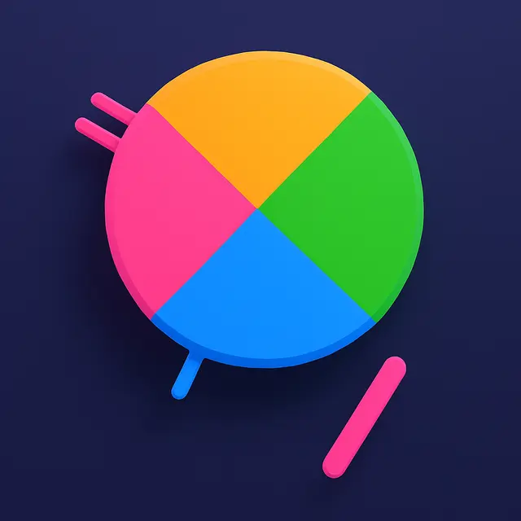

# 

# Sticks

## 🎮 Play the Live Game

Play instantly on Farcade:
[https://app.farcade.ai?gameId=qLQRPw4PFA3Y](https://app.farcade.ai?gameId=qLQRPw4PFA3Y)

### 📊 Game Stats (Top Game on Farcade)
- **Plays:** 68,537 total plays
- **Users:** 6,024 unique users
- **Time:** 320 hours played
- **Rating:** 4.2 (85 ratings)

---

## 🚀 Remix This Game!

- **Fork this repo** to start your own version.
- **Remix the code**: Change art, rules, or add your own features.
- **Upload to Farcade**: Build and copy your `dist/index.html` to [Farcade](https://app.farcade.ai) to publish your remix.

---

## About

Sticks is a fast-paced color-matching arcade game built with Phaser.js and TypeScript for the Farcade platform. Toss sticks to match colors, avoid collisions, and climb the levels. Remix, improve, and share your own version!
